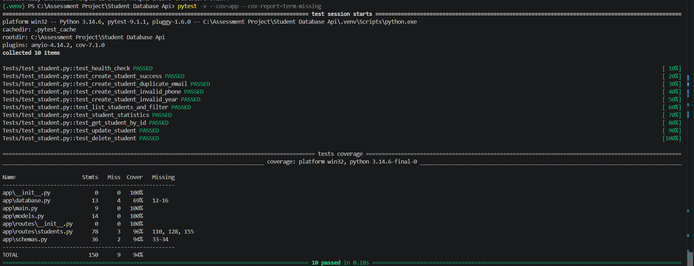
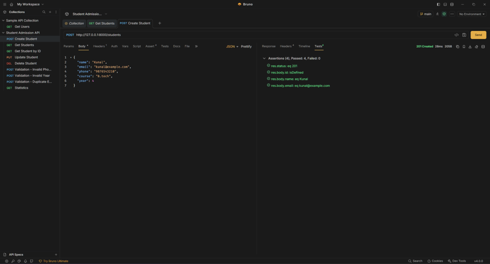
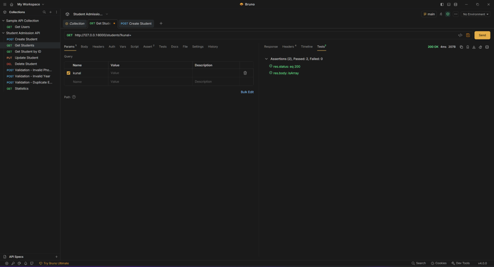
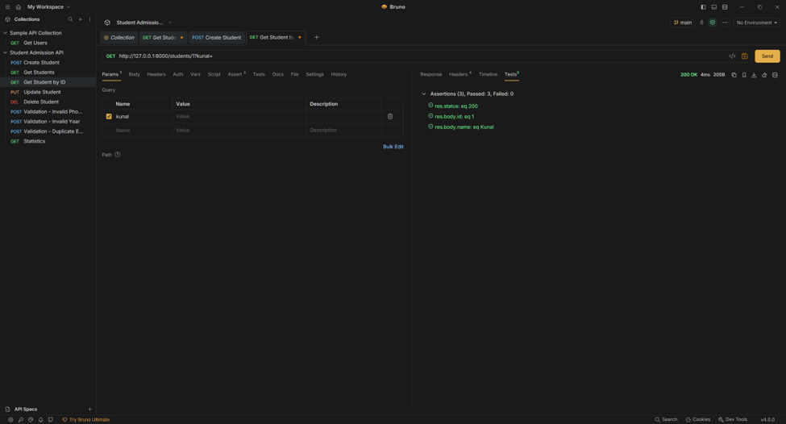
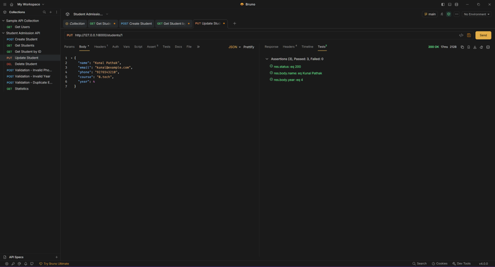
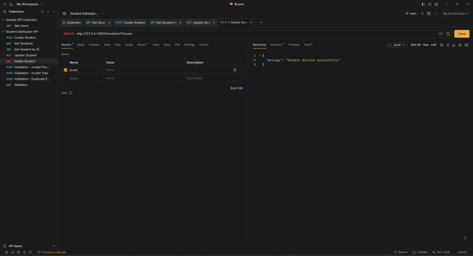
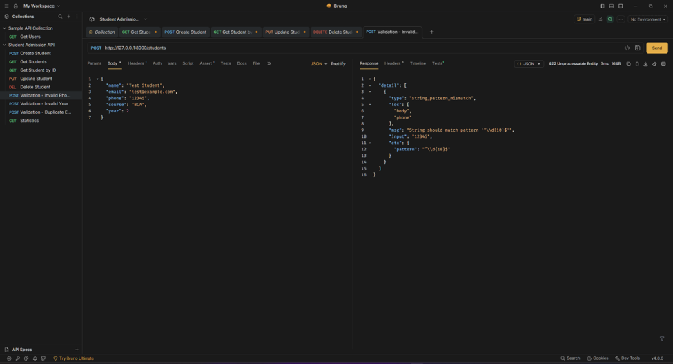
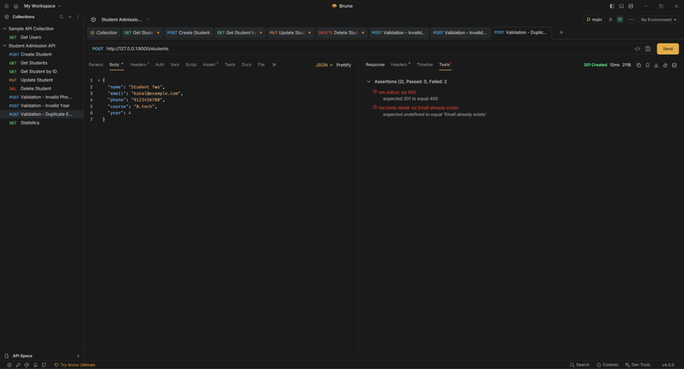
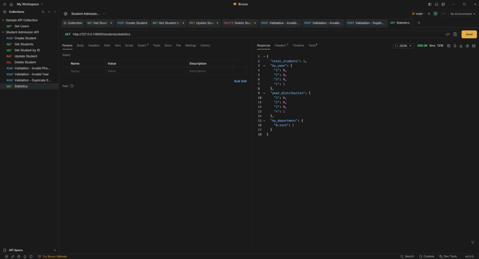

Student Admission Management API

A RESTful Student Admission Management API built with Python, FastAPI, Pydantic, SQLAlchemy ORM, and SQLite.

The API provides complete student CRUD operations, request validation, email uniqueness checks, filtering, pagination, student statistics, and automated tests.

Features-
RESTful API built with FastAPI
SQLite database with SQLAlchemy ORM
Student registration and management
Create, read, update, and delete operations
Unique email validation
Case-insensitive email uniqueness checking
10-digit phone number validation
Academic year validation from 1 to 4
Student filtering by:
Academic year
Department
Course
Pagination using skip and limit
Student statistics endpoint
Automatic created_at and updated_at timestamps
Interactive Swagger/OpenAPI documentation
ReDoc API documentation
Automated testing with Pytest
Code coverage reporting
Technology Stack
Technology	Purpose
Python 3.12+	Backend programming language
FastAPI	REST API framework
Pydantic	Request/response validation
SQLAlchemy	ORM and database interaction
SQLite	Database
Uvicorn	ASGI server
Pytest	Automated testing
Pytest-Cov	Test coverage
HTTPX	API testing support
Git & GitHub	Version control

Application Components -

App/main.py - Initializes the FastAPI application, creates database tables, registers the student router, and provides the health-check endpoint.

App/database.py - Configures the SQLite database, SQLAlchemy engine, database sessions, and database dependency.

App/models.py - Defines the SQLAlchemy Student database model.

App/schemas.py - Defines Pydantic schemas for student creation, updates, responses, and statistics.

App/routes/students.py - Contains all student-related REST API endpoints and database operations.

Tests/ - Contains automated tests for the API's health check, CRUD operations, validation, filtering, duplicate emails, and statistics.

###PYTEST-

###Testing- (BRUNO COLLECTION)
Create Student

###Get Students

###Get Students by ID

###Update Student

###Delete Student

###Validation of phone number

###Validation of duplicate Email

###Getting statistics

